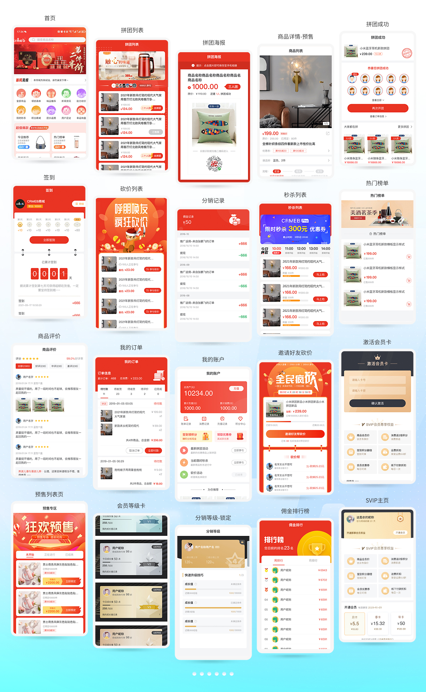
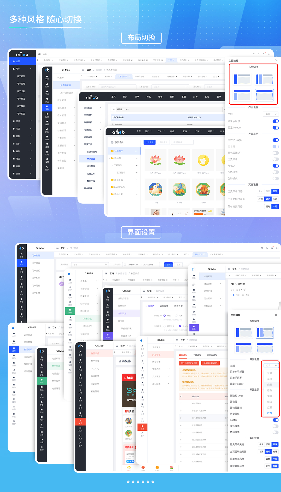

<div align="center" >
    
</div>

<div align="center">

CRMEB开源商城系统PHP版

</div>

<div align="center" >
    <a href="http://www.crmeb.com">
        
    </a>
    <a href="http://www.crmeb.com">
        
    </a>
     <a href="https://gitee.com/ZhongBangKeJi/CRMEB/repository/archive/master.zip">
        
    </a>
    <a href='https://gitee.com/ZhongBangKeJi/CRMEB/stargazers'>
       </img>
    </a>
</div>

####

<div align="center">

[官网](https://www.crmeb.com/) |
[在线体验](http://v4.crmeb.net/admin/) |
[帮助文档](https://doc.crmeb.com/single/v54/) |
[应用市场](https://www.crmeb.com/market/) |
[技术社区](https://www.crmeb.com/ask/)

[comment]: <> ([宽屏预览]&#40;https://gitee.com/ZhongBangKeJi/CRMEB/blob/master/README.md&#41;)

</div>

<div align="center" >
<a href="https://gitee.com/ZhongBangKeJi/CRMEB/blob/master/README.md">宽屏预览</a>
</div>


---

### 📋 更新说明


点击查看<a href="https://doc.crmeb.com/single/v54/14013" target="_blank">更新记录</a>


### 用心做开源，我们也很需要你的鼓励！右上角Star🌟，等你点亮！

---

### 📝 介绍
CRMEB开源商城系统是一款全开源可商用的系统，前后端分离开发，全部100%开源，在小程序、公众号、H5、APP、PC端都能用，使用方便，二开方便！安装使用也很简单！使用文档、接口文档、数据字典、二开文档、视频教程，各种资料应有尽有，就算你是技术小白，也能轻松上手！

欢迎大家来体验、来提建议，来一起让CRMEB开源商城系统更强大，让更多开发者受益！虽然是开源，但我们该有的功能全都有！拼团、秒杀、优惠券、抽奖、积分、直播、分销、页面DIY... 常用商城系统功能，都是全开源，直接用！

CRMEB开源商城Java版：https://gitee.com/ZhongBangKeJi/crmeb_java

---

### 🫧 系统亮点
~~~
1.前后端分离：后端TP6，管理端Element UI（支持多种风格和布局切换），移动端Uni-app；
2.代码规范：遵循PSR-2命名规范、Restful标准接口、代码严格分层、注释齐全、统一错误码；
3.权限管理：内置强大灵活的权限管理，可以控制到每一个菜单；
4.开发配置：低代码增加配置、系统组合数据模块；
5.代码生成：快速生成后台菜单、页面，快速实现增删改查；
6.定时任务：系统内置10中定时任务，还有自定义任务，可以自行设置执行周期，执行代码，完美兼容；
7.系统事件：埋入30+系统事件锚点，可在后台页面进行事件添加；
8.在线编辑：可以在后台对系统的代码进行编辑修改操作，不用登录服务器去修改代码文件，方便快捷；
9.接口管理：后台页面可以看到系统中所有的接口数据，并且可以在线调试接口；
10.二开效率：应用form-builder PHP可以快速生成表单；
11.快速上手：详细帮助文档、后台接口管理、后台数据库字典、系统文件管理备注、代码注释、一键安装；
12.系统安全：系统操作日志、系统生产日志、文件校验、数据备份；
13.高 性 能：支持Redis缓存、队列、长连接、多种云储存、支持集群部署；
14.多 语 言:支持自动识别浏览器多语言展示；
15.驱动扩展：支持多种支付方式、多种短信、多种云储存等；
~~~

###  📱 系统演示


管理后台： http://v5.crmeb.net/admin

账号：demo 密码：crmeb.com

H5端：http://v5.crmeb.net/ （移动端打开）

PC端：http://v5.crmeb.net/ （电脑端打开）

APP下载：http://app.crmeb.cn/bzv （苹果手机直接在APP Store里搜索CRMEB下载）

> 听说，大神你想看看CRMEB开源项目的完整框架？<a href="https://doc.crmeb.com/single/v5/7712" target="_blank">戳这儿，轻松获取！</a>

---

###  📲 核心功能
系统功能
~~~
移动端支持DIY：22种组件；
多种风格和布局切换：8种风格4种布局；
多种语言配置：支持200多个国家语言；
多应用端展示：公众号端、H5端、小程序端、APP端、PC端（需要购买）；
多种消息通知：公众号模版、小程序模版、短信、打印机、企业微信；
低代码：生成功能模块、增加系统配置、组合数据；
对外接口：包含用户、商品、订单等接口，方便其它系统对接；
多种云储存：阿里云、腾讯云、华为云、京东云、七牛云、天翼云；
~~~
商城功能
~~~
多种支付方式：微信支付、支付宝支持、通联支付；
多种商品类型：标准商品、虚拟商品、卡密商品、优惠券商品；
多种营销功能：拼团、砍价、秒杀、抽奖、优惠券、积分、经验、分销、充值、签到、渠道码；
多种运费方式：快递、配送、自提、包邮、超强运费模版管理、多自提点；
~~~
用户管理
~~~
用户等级：用户等级 经验升级 经验任务；
SVIP会员：付费会员 试用会员 实体会员卡 会员权益
用户管理：用户类型 添加用户 用户标签/分组 用户操作 浏览记录
登录方式：H5登录 微信快速登录 密码登录/注册
微信端登录：微信授权登录 手机号快速登录 账号密码登录
支持单点登录：快速接入第三方系统
~~~
微信小程序直播
~~~
直播间管理 主播管理 直播商品管理
~~~
CMS管理
~~~
文章内容	文章管理	文章分类 文章列表
~~~
客服系统
~~~
客服管理:客服添加 客服权限 关键字回复
客服工作台:客服状态 发送信息 订单处理 商品记录 转接客服 客服常用语 客户信息管理 支持H5端和PC端
客户端：支持平台用户H5端、PC端，支持广告配置
~~~
第三方设置
~~~
短信
商品采集
小票打印
电子面单打印
物流查询
电子发票
云存储
~~~
开发工具
~~~
数据库管理
文件在线管理
接口文档管理
代码功能模块生成
数据字典管理
对外接口管理
低代码事件
低代码定时任务
多语言一键配置
数据维护
安全维护
~~~


---

###  📖 UI界面展示




---

###  📖 后台界面展示




---

### 🖥 运行环境

```
Nignx（推荐）/Apache/IIS
PHP 7.1 ~ 7.4
MySQL 5.7 ～ 8.0
Redis （可选）
```


> 温馨提示：虚拟空间不支持，推荐使用bt宝塔面板，服务器推荐京东云服务器：<a href="https://partner.jdcloud.com/partner/notice/b06c3232b6394fdfa496923b8e00b286" target="_blank">注册即享6.5折专属优惠，点我领取！</a>

###  🔐 安装教程

想要快速安装，教程来助攻！<a href="https://doc.crmeb.com/single/v5/7714" target="_blank">查看安装教程！</a>

---

###  📞 CRMEB互动
#### CRMEB开源技术交流群（扫码进群可领取开源版接口文档、产品功能清单、高清UI设计图、思维脑图！）

#### 技术社区！找方法、提bug、看官方消息、拿活跃大奖！都在 <a href="https://www.crmeb.com/ask" target="_blank">CRMEB 技术社区</a> 应有尽有

---

欢迎<a href="https://gitee.com/ZhongBangKeJi/CRMEB/issues" target="_blank">反馈问题</a>

欢迎<a href="https://gitee.com/ZhongBangKeJi/CRMEB/pulls" target="_blank">提交代码</a>


---
###  📺 版权须知

Apache License 2.0 许可的主要内容包括：

1. 授权：允许任何人以任何目的使用、复制、修改和分发该软件。

2. 版权声明：要求在软件和相关文档中包含原始版权声明和许可证声明。

3. 保证免责：表明该软件是按现状提供的，没有任何明示或暗示的担保或保证。作者不承担任何赔偿责任。

4. 贡献者授权：要求所有贡献者授予 Apache 软件基金会永久性的、免费的、不可撤销的许可，以使用、复制、修改和分发其贡献。

5. 专利许可：为了保护使用该软件的用户，该许可要求贡献者授权任何必要的专利许可，以便将其用于 Apache 软件基金会的项目。

Apache License 2.0 是一种宽松的开源许可，允许人们自由使用、修改和分发软件。

---
###  💾 版权信息

本项目包含的第三方源码和二进制文件之版权信息另行标注。

版权所有Copyright © 2017-2024 by CRMEB (https://www.crmeb.com)

All rights reserved。

CRMEB® 商标和著作权所有者为西安众邦网络科技有限公司。

---

###  📕 多商户PHP

[](https://www.crmeb.com/index/merchant)

---

[返回顶部 :fa-arrow-circle-up: ](https://gitee.com/ZhongBangKeJi/CRMEB#%E9%A1%B9%E7%9B%AE%E4%BB%8B%E7%BB%8D)

