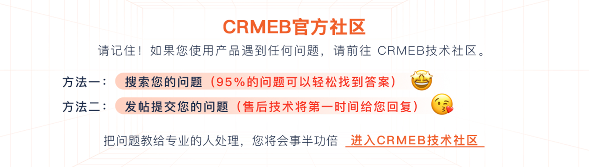
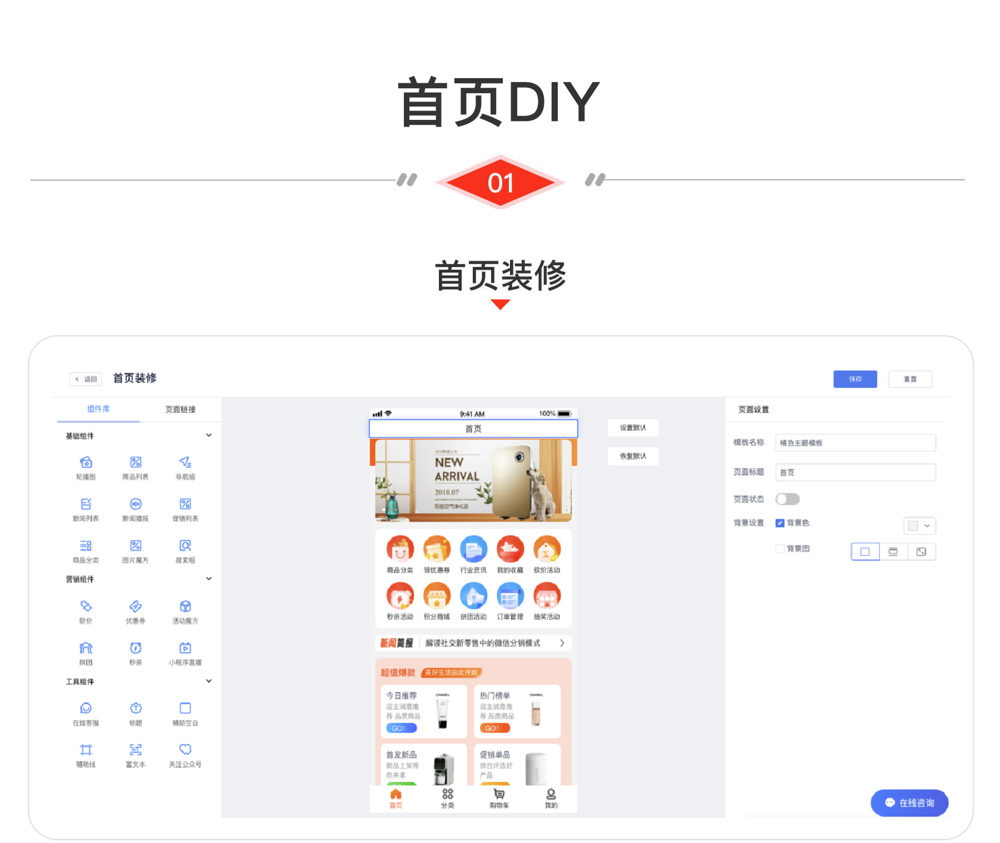
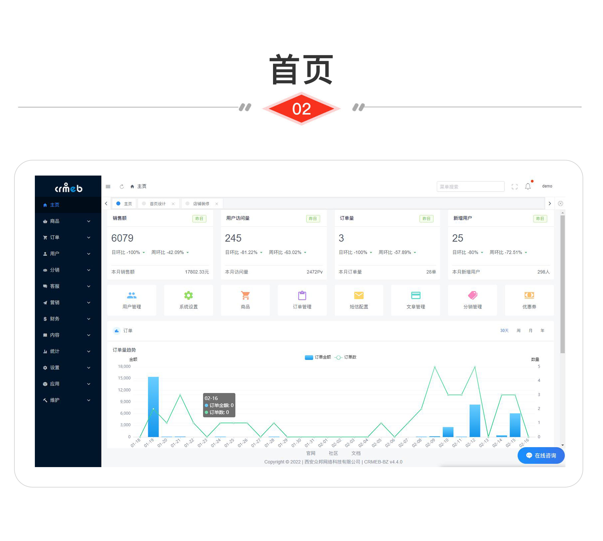
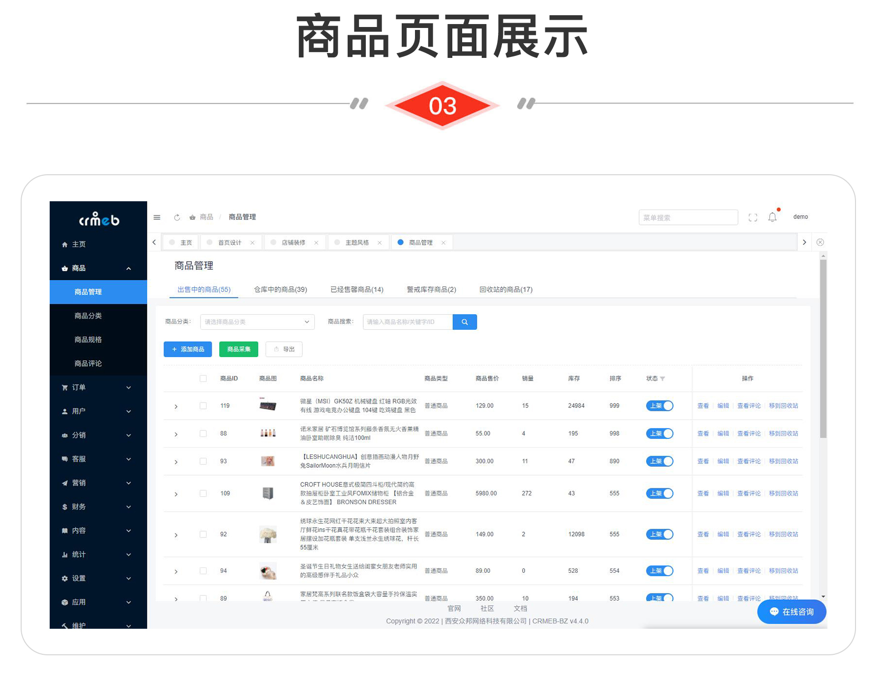

<div align="center" >
    
</div>
<div align="center">

支持免费商用的PHP **多语言** 商城系统

</div>

<div align="center" >
    <a href="http://www.crmeb.com">
        
    </a>
    <a href="http://www.crmeb.com">
        
    </a>
     <a href="https://gitee.com/ZhongBangKeJi/CRMEB/repository/archive/master.zip">
        
    </a>
    <a href='https://gitee.com/ZhongBangKeJi/CRMEB/stargazers'>
       </img>
    </a>
</div>

#### 

<div align="center">

[官网](https://www.crmeb.com/) |
[在线体验](http://v4.crmeb.net/admin/) |
[帮助文档](https://doc.crmeb.com/single/crmeb_v4) |
[技术社区](https://www.crmeb.com/ask/)

[comment]: <> ([宽屏预览]&#40;https://gitee.com/ZhongBangKeJi/CRMEB/blob/master/README.md&#41;)

</div>
<div align="center" >
<a href="https://gitee.com/ZhongBangKeJi/CRMEB/blob/master/README.md">宽 屏 预 览</a>
</div>

### 介绍
CRMEB打通版是历经6年时间匠心之作！系统全开源可商用，包含小程序商城、H5商城、公众号商城、PC商城、App，多种分销模式、拼团、砍价、秒杀、优惠券、抽奖、积分、会员等级、小程序直播、页面DIY，前后端分离全部100%开源。方便二开，更有详细使用文档、接口文档、数据字典、二开文档/视频教程。为开发者赋能，助力企业发展、国家富强，致力于打造最受欢迎的商城项目

CRMEB开源商城Java版：https://gitee.com/ZhongBangKeJi/crmeb_java


### 系统亮点
~~~
多 语 言：后台随时配置语言包，移动端支持多语言切换；
高 性 能：redis缓存、队列、长连接、多种云储存、支持集群部署；
个 性 UI：多种风格切换、支持DIY各种首页/专题页面
前后端分离：后端TP6，管理端iviewui，移动端uniapp；
代码规范：遵循PSR-2命名规范、Restful标准接口、代码严格分层、注释齐全、统一错误码；
权限管理：内置强大灵活的权限管理，可以控制到每一个菜单；
开发配置：低代码增加配置、系统组合数据模块；
二开效率：PHP快速生成表单、内置所有事件、后台在线编辑器、代码注释齐全、完整接口文档；
快速上手：详细帮助文档、接口文档、数据库字典、代码注释、一键安装；
系统安全：系统操作日志、系统生产日志、文件校验、数据备份；
系统功能：请看帮助文档 https://doc.crmeb.com/single/crmeb_v4/1758
用户体验：等您来评！
~~~


### 运行环境

```
Nignx/Apache/IIS
PHP 7.1 ~ 7.4 
MySQL 5.7
Redis
```


> 温馨提示：虚拟空间不支持，推荐使用bt宝塔面板，服务器推荐阿里云ecs或腾讯云cvm 云服务器：<a href="https://promotion.aliyun.com/ntms/yunparter/invite.html?userCode=dligum2z" target="_blank">  查看 </a>

### 官方论坛


[](https://www.crmeb.com/ask/thread/list/147)

产品BUG、优化建议，欢迎社区反馈：https://www.crmeb.com/ask/thread/list?id=147


---

#### 体验云部署
 不懂服务器？不懂技术？无法解决高并发？想数据私有化？还想后期定制开发？

 推荐云部署版一键超低价格低至 :collision:  9.9元/年，解决以上所有问题<a href='https://saas.crmeb.com/saas-home-software-detail-50043-s-y.html' target='_blank'>点击了解 </a>

---


###  系统演示


管理后台： http://v4.crmeb.net/admin 账号：demo 密码：crmeb.com

H5端：http://v4.crmeb.net/（移动端打开）

PC端：http://v4.crmeb.net/（电脑端打开）

APP下载：http://app.crmeb.cn/bzv （苹果手机直接在APP Store里搜索CRMEB下载）

### 页面展示
(页面仅展示部分UI)






<div align="center">
<a href='http://s.crmeb.com/goods_detail/739' target='_blank'>点击查看高清版全套UI设计图</a>
</div>


### 推荐项目(欢迎合作，QQ：763569752 )

| 项目名称  | 关注量  |  项目介绍 |
| ------------ | ------------ | ------------ |
| [](https://gitee.com/ZhongBangKeJi/CRMChat) | [](https://gitee.com/ZhongBangKeJi/CRMChat/stargazers) | CRMChat客服系统，支持接入各种渠道.  |
| [](https://gitee.com/ZhongBangKeJi/crmeb_java) | [](https://gitee.com/ZhongBangKeJi/crmeb_java/stargazers) | JAVA版开源商城.  |
| [](https://gitee.com/xaboy/form-builder) | [](https://gitee.com/xaboy/form-builder/stargazers) | PHP表单生成器，快速生成现代化的form表单。 |
| [](https://gitee.com/layui/layui-vue) | [](https://gitee.com/layui/layui-vue/stargazers) | layui-vue(谐音:类UI)是一套Vue3.0 的桌面端组件库.  |
| [](https://gitee.com/ntdgg/tpflow) | [](https://gitee.com/ntdgg/tpflow/stargazers) | TpFlow工作流引擎是一套规范化的流程管理系统，基于业务而驱动系统生命力的一套引擎.  |

### 商业版购买
开源不易，以下如果有需要，请支持一下，感谢您的支持，让我们更多动力！

[](https://www.crmeb.com/index/criteria)

### 🔥🔥庆祝：CRMEB开源商城系统Gitee star突破10000+  专属活动福利 [点击了解](https://www.crmeb.com/ask/thread/20738)

### 感谢参与开发者
感谢大神们提交代码（排名不分先后）

@yizhisamoye，@bys1123，@xaboy，@youngxj0，@jacklincheung，@392256866，@sxsea

欢迎反馈问题 [反馈问题](https://gitee.com/ZhongBangKeJi/CRMEB/issues)。

欢迎提交代码 [提交代码](https://gitee.com/ZhongBangKeJi/CRMEB/pulls)。

### 特别鸣谢

排名不分先后，感谢这些软件的开发者：thinkphp、iview、vue、mysql、redis、uniapp、echarts、tree-table-vue、swiper、form-create等，如有遗漏请联系我！

### 核心开发团队
产品：木子刀客

技术：聆听、等风来、xaboy、吴汐、最后一片叶、旺仔、小小、娜娜、归来仍是少年

UI：xy-yyds、LXT

测试：夏天、绵绵羊、。ws

### 使用须知

1.允许用于个人学习、毕业设计、教学案例、公益事业、商业使用;

2.如果商用必须保留版权信息，请自觉遵守;

3.禁止将本项目的代码和资源进行任何形式的出售，产生的一切任何后果责任由侵权者自负。

### 版权信息

本项目包含的第三方源码和二进制文件之版权信息另行标注。

版权所有Copyright © 2017-2023 by CRMEB (https://www.crmeb.com)

All rights reserved。

CRMEB® 商标和著作权所有者为西安众邦网络科技有限公司。

---
[返回顶部 :fa-arrow-circle-up: ](https://gitee.com/ZhongBangKeJi/CRMEB#%E9%A1%B9%E7%9B%AE%E4%BB%8B%E7%BB%8D)

