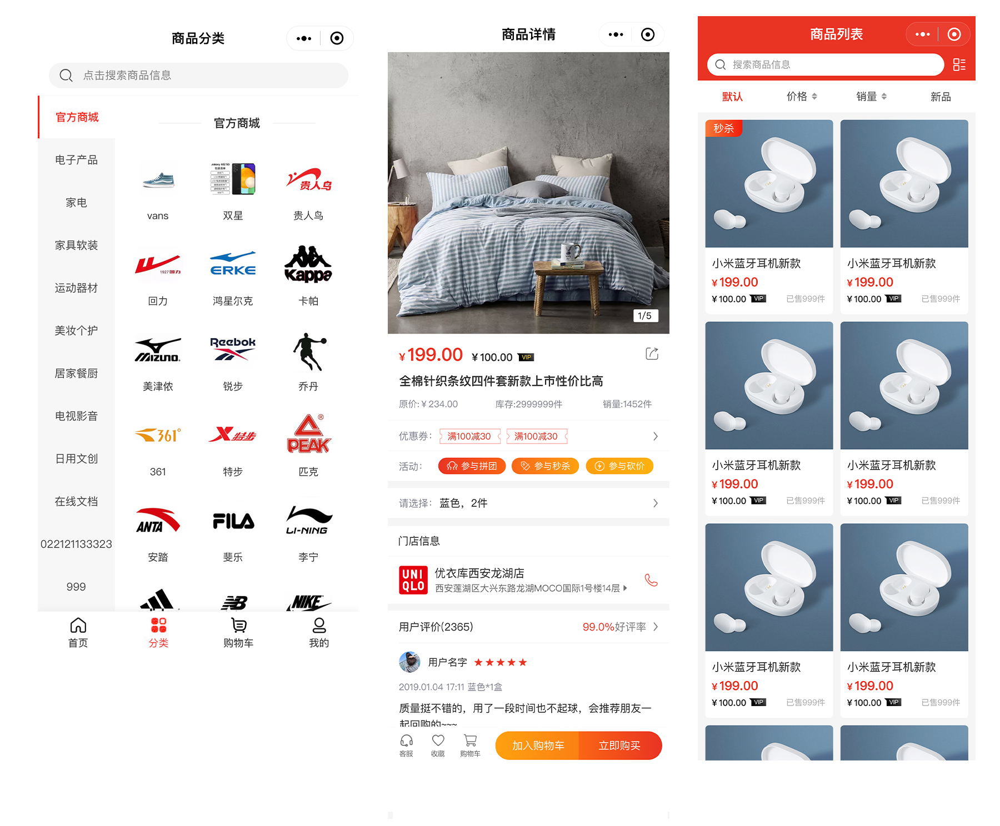

.jpg")
<p align="center" >
    
</p>

<h3 align="center"> 码云开源项目php语言排名前三的开源GVP项目！</h3> 

 

 CRMEB打通版是一款全开源支持免费商用的PHP单商户商城系统；
 
 CRMEB技术团队（官网：www.crmeb.com)历经4年时间匠心之作！系统采用前后端分离技术，基于TP6+Uni-app框架开发；客户移动端采用uni-app开发，管理后台前端使用iviewUI开发。系统支持微信公众号端、微信小程序端、H5端、PC端多端账号同步，可快速打包生成APP；
 
 赋能开发者，减少重复造轮子；系统支持自动检查安装环境一键安装部署，使用简单方便；围绕方便二次开发，系统内置强大灵活的权限管理，可以控制到每一个菜单；通过内置组合数据,管理碎片化数据,系统配置快速添加系统配置参数，内置钩子，方便二开；后台应用form-builder PHP快速生成现代化表单；并提供详细的使用文档、开发文档、接口文档、数据字典等相关文档；及十几个技术交流群、技术论坛答疑；帮助更多开发者快速上手，节省开发时间，提升开发效率；助力企业实现数字化经营！
 
<p align="center" >
<a href="https://gitee.com/ZhongBangKeJi/CRMEB/blob/master/README.md"> 宽屏预览 </a>
</p>


- - -

   :fa-th-list:  [官网地址](https://www.crmeb.com)
 | [服务市场](https://s.crmeb.com)
 | [系统功能](https://gitee.com/ZhongBangKeJi/CRMEB#%E7%B3%BB%E7%BB%9F%E5%8A%9F%E8%83%BD)
 | [系统演示](https://gitee.com/ZhongBangKeJi/CRMEB#%E7%B3%BB%E7%BB%9F%E6%BC%94%E7%A4%BA)
 | [使用手册](https://doc.crmeb.com/web/single/crmeb_v4/998)
 | [二开手册](https://gitee.com/ZhongBangKeJi/CRMEB/wikis/%E5%BA%8F%E8%A8%80?sort_id=4100490)
 | [论坛地址](https://q.crmeb.com)
 | [TP6开发手册](https://www.kancloud.cn/manual/thinkphp6_0/content)
 | [推荐服务器](https://promotion.aliyun.com/ntms/yunparter/invite.html?userCode=dligum2z)
 | [留言评论](https://gitee.com/ZhongBangKeJi/CRMEB#%E7%89%88%E6%9D%83%E4%BF%A1%E6%81%AF)
- - -

## 相关文档

系统功能：<a href="https://doc.crmeb.com/web/single/crmeb_v4/1758"  target="_blank">功能清单</a>

系统脑图：<a href="https://doc.crmeb.com/web/single/crmeb_v4/1756"  target="_blank">思维脑图</a>

接口文档：<a href="https://doc.crmeb.com/web/single/crmeb_v4/1760"  target="_blank">在线接口</a>

目录结构：<a href="https://doc.crmeb.com/web/single/crmeb_v4/1129"  target="_blank">目录结构</a>

数据字典：<a href="https://doc.crmeb.com/web/single/crmeb_v4/1130"  target="_blank">数据字典</a>

安装教程：<a href="https://doc.crmeb.com/web/single/crmeb_v4/892"  target="_blank">安装教程</a>

二开教程：<a href="https://ke.qq.com/course/4125326?tuin=5e252c1"  target="_blank">CRMEB Uniapp前端二开视频教程 点击学习</a>

二开文档：<a href="https://gitee.com/ZhongBangKeJi/CRMEB-Min/wikis/%E5%BA%8F%E8%A8%80?sort_id=3303670"  target="_blank">二开文档</a>

技术交流社区：<a href="https://q.crmeb.com"  target="_blank">https://q.crmeb.com


[](http://s.crmeb.com/goods_detail/730)
[](http://s.crmeb.com/goods_detail/728)
[](http://s.crmeb.com/goods_detail/729)
[](http://s.crmeb.com/goods_detail/711)

#### 不懂服务器？不懂技术？无法解决高并发？想数据私有化？还想后期定制开发？

推荐云部署版一键解决以上所有问题，超低价格低至 :collision:  9.9元/年，点击了解 https://saas.crmeb.com/saas-home-software-detail-50042-s-y.html

#### 推荐服务器（虚拟空间不支持）

服务器环境推荐要求：<a href="https://promotion.aliyun.com/ntms/yunparter/invite.html?userCode=dligum2z" target="_blank">  查看 </a>

```
Nignx/Apache/IIS
PHP 7.1 ~ 7.3 
MySQL 5.5-7.0
Redis
```


推荐使用bt宝塔面板，简单易用，服务器推荐阿里云ecs或腾讯云cvm 云服务器。


### 官方客服

### CRMEB官方论坛：https://q.crmeb.com

技术交流、安装搭建问题、系统建议反馈 欢迎光临CRMEB官方论坛！

提交BUG、产品建议反馈 有奖悬赏  欢迎参与：https://q.crmeb.com/thread/7380


## 技术亮点
~~~
    1.自主研发独立客服系统；
    2.管理端页面使用iviewUI开发；
    3.PHPExcel数据导出,导出表格更加美观,可视；
    4.EasyWeChat部署微信开发,微信接入更加快捷,简单；
    5.使用强大的workerman实现定时任务和长连接；
    6.内置强大灵活的权限管理，可以控制到每一个菜单；
    7.内置组合数据,系统配置,管理碎片化数据；
    8.客户端完善的交互效果和动画；
    9.对接公众号和小程序,并且数据同步；
    10.后台应用form-builder PHP快速生成现代化表单；
    11.高频数据缓存支持高并发；
    12.数据备份和恢复让数据更安全；
    13.Restful标准接口、前后端分离，内部预留钩子,二次开发更方便;
    14.长连接减少CPU及内存使用及网络堵塞，减少请求响应时长；
    15.支持队列降低流量高峰，解除耦合，高可用;
    16.一键安装自动检查系统环境一键安装；
    17.移动端使用uni-app进行开发，方便编译成各种格式的代码；
~~~

## 页面展示
(页面仅展示部分UI)



## <a href='http://s.crmeb.com/goods_detail/728' target='_blank'>点击查看高清版全套UI设计图</a>


##  系统演示


演示站： http://v4.crmeb.net/admin  

账号：demo  

密码：crmeb.com

####  CRMEB云部署快速体验完整功能 <a href='https://saas.crmeb.com/' target='_blank'>【点击体验】</a>


## 程序下载 


```
老版本v3.2.9 下载（功能全，后台非前后端分离，适合二开）

git clone -b v3.2.9 https://gitee.com/ZhongBangKeJi/CRMEB.git

最新版 下载（当前开源版功能全，前后台分离版，适合二开）

git clone https://gitee.com/ZhongBangKeJi/CRMEB.git

精简版Min下载(基础商城框架，适合精简需求的客户，适合二开)

git clone https://gitee.com/ZhongBangKeJi/CRMEB-Min.git 

```

## 相关项目

 :star: CRMChat客服系统 https://gitee.com/ZhongBangKeJi/CRMChat

TP6+swoole4开源客服系统，支持微信网页、H5端、PC端客服接入，商家端有PC端管理、H5端、App端接待，支持用户添加标签、分组等功能

JAVA版商城：https://gitee.com/ZhongBangKeJi/crmeb_java

CRMEB商城JAVA版，SpringBoot + Maven + Swagger + Mybatis Plus + Redis + Uniapp +Vue+elementUI 包含移动端、小程序、PC后台、Api接口；有产品、用户、购物车、订单、积分、优惠券、营销、余额、权限、角色、系统设置、组合数据、可拖拉拽的form表单等模块，大量的减少了二开的成本。

知识付费：https://gitee.com/ZhongBangKeJi/crmeb_zzff_class

CRMEB知识付费系统是基于ThinkPhp5.0+Vue开发的全开源知识付费系统。功能包含直播课堂、付费视频、付费音频、付费阅读、会员系统、课程分销、课程拼团、直播带货、直播打赏、商城系统等。能够快速积学员、学员数据分析、智能转化客户、有效提高销售、吸引流量、网络营销、品牌推广的一款应用，且更适合企业二次开发

form-builder : https://github.com/xaboy/form-builder

tp PHP表单生成器，快速生成现代化的form表单。包含复选框、单选框、输入框、下拉选择框等元素以及,省市区三级联动,时间选择,日期选择,颜色选择,文件/图片上传等功能。

CRMEB Min版商城：https://gitee.com/ZhongBangKeJi/CRMEB-Min

CRMEB Min是一款轻量级、高性能开源电商商城系统，采用TP6+Mysql+Uniapp+iView+Redis等最流行热门技术语言，支持队列、表单生成、长链接、定时任务等，完善的权限管理、会员管理、产品订单管理、CMS管理、支持多端、一键开通短信、产品采集、物流查询等接口。快速简单高效！

## 特别鸣谢

排名不分先后，感谢这些软件的开发者：thinkphp、iview、vue、mysql、redis、uniapp、echarts、tree-table-vue、swiper、form-create等，如有遗漏请联系我！

## 参与开发

感谢大神们提交代码（排名不分先后）

### @yizhisamoye，@bys1123，@xaboy，@youngxj0，@jacklincheung，@392256866，@sxsea

欢迎反馈问题 [反馈问题](https://gitee.com/ZhongBangKeJi/CRMEB/issues)。

欢迎提交代码 [提交代码](https://gitee.com/ZhongBangKeJi/CRMEB/pulls)。

## 开源版使用须知

1.允许用于个人学习、毕业设计、教学案例、公益事业;

2.如果商用必须保留版权信息，请自觉遵守;

3.禁止将本项目的代码和资源进行任何形式的出售，产生的一切任何后果责任由侵权者自负。

## 版权信息


本项目包含的第三方源码和二进制文件之版权信息另行标注。

版权所有Copyright © 2017-2022 by CRMEB (https://www.crmeb.com)

All rights reserved。

CRMEB® 商标和著作权所有者为西安众邦网络科技有限公司。

[返回顶部 :fa-arrow-circle-up: ](https://gitee.com/ZhongBangKeJi/CRMEB#%E9%A1%B9%E7%9B%AE%E4%BB%8B%E7%BB%8D)
