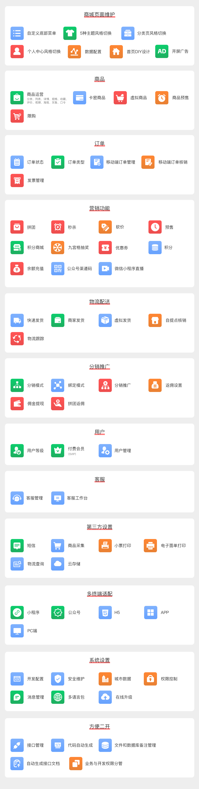
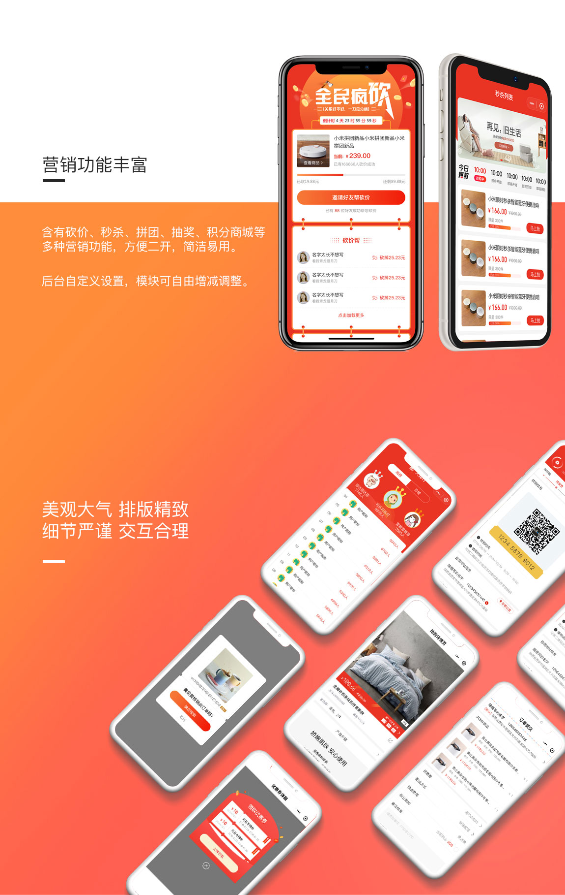
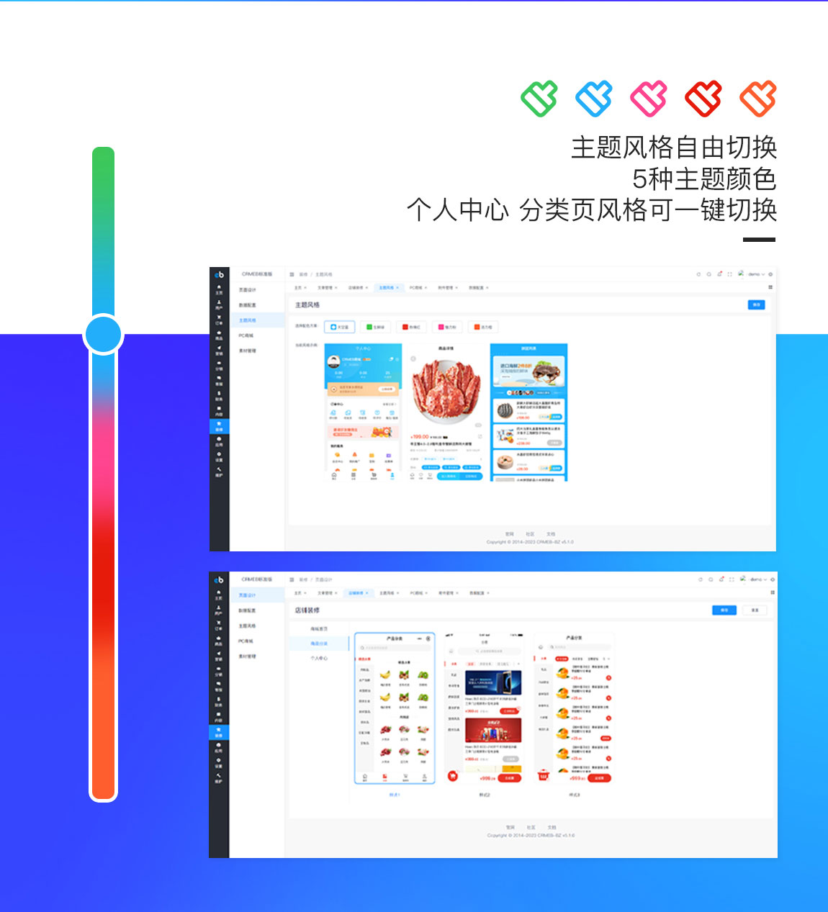
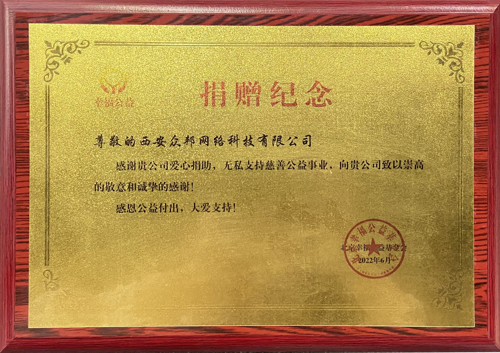
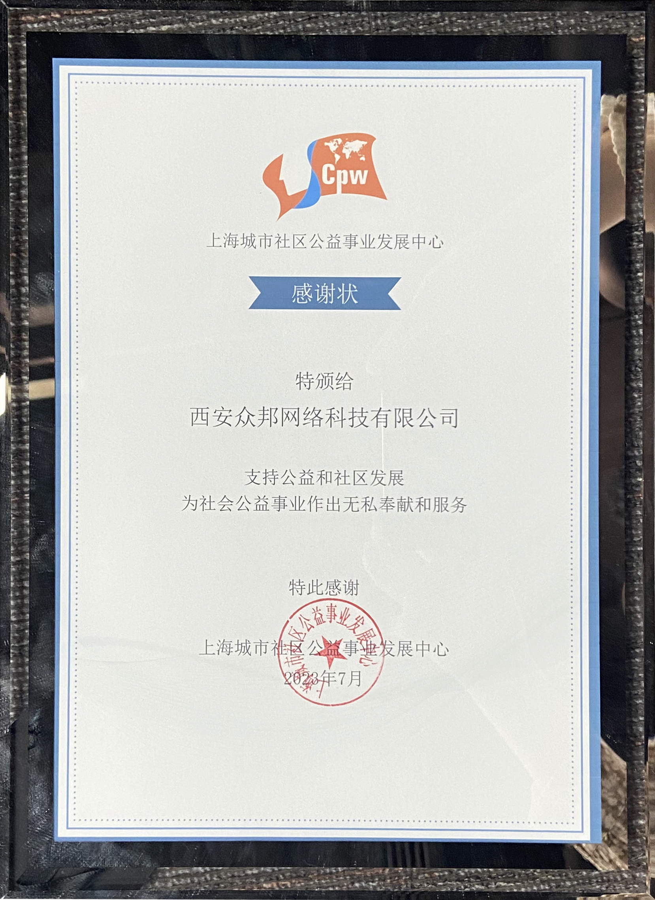

<div align="center" >
    
</div>
<div align="center">

CRMEB开源商城系统PHP版

</div>

<div align="center" >
    <a href="http://www.crmeb.com">
        
    </a>
    <a href="http://www.crmeb.com">
        
    </a>
     <a href="https://gitee.com/ZhongBangKeJi/CRMEB/repository/archive/master.zip">
        
    </a>
    <a href='https://gitee.com/ZhongBangKeJi/CRMEB/stargazers'>
       </img>
    </a>
</div>

#### 

<div align="center">

[官网](https://www.crmeb.com/) |
[在线体验](http://v4.crmeb.net/admin/) |
[帮助文档](https://doc.crmeb.com/single/v53/) |
[应用市场](https://www.crmeb.com/market/)
[技术社区](https://www.crmeb.com/ask/)

[comment]: <> ([宽屏预览]&#40;https://gitee.com/ZhongBangKeJi/CRMEB/blob/master/README.md&#41;)

</div>
<div align="center" >
<a href="https://gitee.com/ZhongBangKeJi/CRMEB/blob/master/README.md">宽屏预览</a>
</div>

---

### 📋 更新说明


点击查看<a href="https://doc.crmeb.com/single/v53/12202" target="_blank">更新记录</a>


### 用心做开源，我们也很需要你的鼓励！右上角Star🌟，等你点亮！

---

### 📝 介绍
CRMEB开源商城系统是一款全开源可商用的系统，前后端分离开发，全部100%开源，在小程序、公众号、H5、APP、PC端都能用，使用方便，二开方便！安装使用也很简单！使用文档、接口文档、数据字典、二开文档、视频教程，各种资料应有尽有，就算你是技术小白，也能轻松上手！

欢迎大家来体验、来提建议，来一起让CRMEB开源商城系统更强大，让更多开发者受益！虽然是开源，但我们该有的功能全都有！拼团、秒杀、优惠券、抽奖、积分、直播、分销、页面DIY... 常用商城系统功能，都是全开源，直接用！

CRMEB开源商城Java版：https://gitee.com/ZhongBangKeJi/crmeb_java

---

### 🫧 系统亮点
~~~
1.前后端分离：后端TP6，管理端Element UI，移动端Uni-app；
2.代码规范：遵循PSR-2命名规范、Restful标准接口、代码严格分层、注释齐全、统一错误码；
3.权限管理：内置强大灵活的权限管理，可以控制到每一个菜单；
4.开发配置：低代码增加配置、系统组合数据模块；
5.二开效率：应用form-builder PHP快速生成表单、内置所有事件、后台接口管理调试、后台代码在线编辑器、代码生成，快速对接第三方接口；
6.快速上手：详细帮助文档、后台接口管理、后台数据库字典、系统文件管理备注、代码注释、一键安装；
7.系统安全：系统操作日志、系统生产日志、文件校验、数据备份；
8.高 性 能：支持Redis缓存、队列、长连接、多种云储存、支持集群部署。

~~~
---

### 🖥 运行环境

```
Nignx/Apache/IIS
PHP 7.1 ~ 7.4 
MySQL 5.7 ～ 8.0
Redis
```


> 温馨提示：虚拟空间不支持，推荐使用bt宝塔面板，服务器推荐京东云服务器：<a href="https://partner.jdcloud.com/partner/notice/b06c3232b6394fdfa496923b8e00b286" target="_blank">注册即享6.5折专属优惠，点我领取！</a>


###  📱 系统演示


管理后台： http://v5.crmeb.net/admin

账号：demo 密码：crmeb.com

H5端：http://v5.crmeb.net/ （移动端打开）

PC端：http://v5.crmeb.net/ （电脑端打开）

APP下载：http://app.crmeb.cn/bzv （苹果手机直接在APP Store里搜索CRMEB下载）

> 听说，大神你想看看CRMEB开源项目的完整框架？<a href="https://doc.crmeb.com/single/v5/7712" target="_blank">戳这儿，轻松获取！</a>

---

###  🔐 安装教程

想要快速安装，教程来助攻！<a href="https://doc.crmeb.com/single/v5/7714" target="_blank">查看安装教程！</a>

---

###  📲 核心功能




---

###  📖 UI界面展示






---


###  📕 CRMEB公益
做开源，帮助更多人！CRMEB开源项目，不仅让开发者从中受益，也在公益活动中帮助了很多人，对此，我们很荣幸，也乐此不疲！

So~~想要用CRMEB开源商城系统做公益项目的朋友，可以来免费申请商业版系统哦！有需要的朋友，快去找官方客服咨询吧！




---
###  💎 捐赠
赠人玫瑰，手留余香！CRMEB诚挚地邀请大家积极参与捐赠，我们会将捐赠获得的费用，悉数用于支持公益项目，让善意无限传递下去！
在此深表感谢~

---
###  📞 CRMEB互动
#### CRMEB开源技术交流群
#### 扫码进群可领取开源版接口文档、产品功能清单、高清UI设计图、思维脑图！

#### 技术社区！找方法、提bug、看官方消息、拿活跃大奖！都在 <a href="https://www.crmeb.com/ask" target="_blank">CRMEB 技术社区</a> 应有尽有

---

###  📻 感谢参与开发者
#### 感谢大神们提交代码（排名不分先后）
@yizhisamoye，@bys1123，@xaboy，@youngxj0，@jacklincheung，@392256866，@sxsea

欢迎<a href="https://gitee.com/ZhongBangKeJi/CRMEB/issues" target="_blank">反馈问题</a>

欢迎<a href="https://gitee.com/ZhongBangKeJi/CRMEB/pulls" target="_blank">提交代码</a>

---
###  📸 特别鸣谢
排名不分先后，感谢这些软件的开发者：thinkphp、iview、vue、mysql、redis、uniapp、echarts、tree-table-vue、swiper、form-create等，如有遗漏请联系我！

---
###  🎬 核心开发团队
产品：木子刀客

技术：聆听、等风来、xaboy、吴汐、最后一片叶、旺仔、小小、娜娜、归来仍是少年

UI：xy-yyds、LXT

测试：夏天、绵绵羊、。ws、半山


---
###  📺 版权须知

Apache License 2.0 许可的主要内容包括：

1. 授权：允许任何人以任何目的使用、复制、修改和分发该软件。

2. 版权声明：要求在软件和相关文档中包含原始版权声明和许可证声明。

3. 保证免责：表明该软件是按现状提供的，没有任何明示或暗示的担保或保证。作者不承担任何赔偿责任。

4. 贡献者授权：要求所有贡献者授予 Apache 软件基金会永久性的、免费的、不可撤销的许可，以使用、复制、修改和分发其贡献。

5. 专利许可：为了保护使用该软件的用户，该许可要求贡献者授权任何必要的专利许可，以便将其用于 Apache 软件基金会的项目。

Apache License 2.0 是一种宽松的开源许可，允许人们自由使用、修改和分发软件。

---
###  💾 版权信息

本项目包含的第三方源码和二进制文件之版权信息另行标注。

版权所有Copyright © 2017-2024 by CRMEB (https://www.crmeb.com)

All rights reserved。

CRMEB® 商标和著作权所有者为西安众邦网络科技有限公司。


---

[返回顶部 :fa-arrow-circle-up: ](https://gitee.com/ZhongBangKeJi/CRMEB#%E9%A1%B9%E7%9B%AE%E4%BB%8B%E7%BB%8D)

